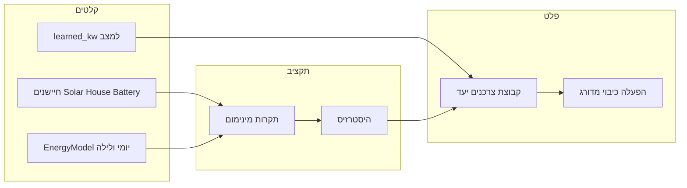

# תכנון: תקציב צרכנים ולוגיקת עומס מבוססת למידה

## מצב נוכחי (קצר)

- [coordinator.py](c:\dev\energy_management\custom_components\energy_manager\coordinator.py): כל ~30 שניות מעדכן מודל, מריץ [decision_engine.py](c:\dev\energy_management\custom_components\energy_manager\engine\decision_engine.py), וקורא ל־`load_manager.apply_mode(mode)` בלבד — **בלי תקציב kW**.
- [load_manager.py](c:\dev\energy_management\custom_components\energy_manager\engine\load_manager.py): ב־`wasting` מדליק **צרכן אחד** כל `consumer_delay` דקות (סדר רשימה); ב־`normal` כיבוי LIFO; ב־`saving` הכל כבוי.
- [consumer_learn.py](c:\dev\energy_management\custom_components\energy_manager\engine\consumer_learn.py): `learned_kw` קיים אך **לא** משמש לשליטה.

## יעד המערכת (לוגיקה)

1. לחשב **מפת תקרות** ואז **תקציב יעד אחד** = המינימום בין התקרות הרלוונטיות לאותו רגע.
2. לבחור **איזה צרכנים אמורים להיות דלוקים**: סדר עדיפות קיים; לצרכן **עם למידה** — סכום `learned_kw` לא עובר תקציב (greedy מההתחלה); לצרכן **בלי למידה** — עדיין להדליק לצורך דגימה, עם **המתנה 5 דקות** קבועה בקוד בין פעולות הקשורות לכך; לצרכן **מלומד** — **דקה אחת** בין פעולות.
3. **היסטרזיס באחוזים** (ברירת מחדל ~15%, קונפיגורציה אופציונלית): לא לעדכן קבוצת יעד אם שינוי התקציב הגולמי קטן יחסית לתקציב “שננעל” בפעם הקודמת.
4. **תקרת פריקה מסוללה עם מקדם בטחון** (למשל ~~30% רזרבה → שימוש ב־~~70% מהראשroom): רלוונטי כשPV לא מכסה בפועל את העומס הנוסף; לפני הרחבת קבוצה, לוודא שהצרכן הבא (לפי למידה) לא ידחוף פריקה מעבר למותר אחרי המקדם.
5. **שילוב עם לוגיקה יומית קיימת**: מנוע ההחלטות נשאר מקור לאותו `system_mode`; התקציב **מצמצם בזבוז** כשהתמונה היומית/שHourית צרה (להלן), לא מחליף את ה־decide() הקיים.

## תקרות תקציב (מנוע פנימי)

כל התקרות ל־**kW לא פחות מ־0**; התוצאה היא `min(...)` על קומפוננטות שמוחלות ברגע נתון.

| רכיב         | מקור                                                                                                                   | הערה למימוש                                                                                                                                                                                                                                                                                                                                                                      |
| ------------ | ---------------------------------------------------------------------------------------------------------------------- | -------------------------------------------------------------------------------------------------------------------------------------------------------------------------------------------------------------------------------------------------------------------------------------------------------------------------------------------------------------------------------- |
| מיידי “עודף” | `solar_production_kw`, `house_consumption_kw`, `battery_power_kw`, `inverter_size_kw`                                  | נוסחה מפורשת בקוד (למשל ראשroom AC: התאמה ל־`CONF_INVERTER_SIZE_KW` כש־>0; כש־0 — נגזר מ־`max(0, solar - house - max(0,-battery_power))` או מודל זהה שתאושר בקומיט). המטרה: לכמת מה ניתן להוסיף לעומס **בלי** להסתמך רק על סדר הדלקה עיוור.                                                                                                                                      |
| אסטרטגי יומי | `daily_margin_kwh`, אולי `forecast_next_hour_kwh` מול `house_consumption_kw`                                           | כשהמאגר היומי דל, לכוף תקרת בזבוז נמוכה (פונקציה מונוטונית — לדוגמה קפיצות לפי ספי [MARGIN הקיימים](c:\dev\energy_management\custom_components\energy_manager\const.py) או קו לינארי פשוט). אם אין תחזית — מסתמכים על המודל השמרני הקיים.                                                                                                                                        |
| לילה / פריסה | `night_relaxed`, `night_bridge_usable_kwh`, `hours_until_first_pv` (או `hours_until_sunrise`)                          | כשמזוהה חלון “פריסת לילה”: תקרת ממוצע ≈ `usable_kwh / max(שעות, סף מינימלי)` בנוסף/במקום עודף מיידי — לפי אותם תנאים שכבר מגדירים night bridge ב־[energy_model.py](c:\dev\energy_management\custom_components\energy_manager\engine\energy_model.py).                                                                                                                            |
| פריקה        | `battery_current` אם קיים + `max_battery_current_amps` + `discharge_limit_percent`; אחרת fallback ל־`battery_power_kw` | **ראשroom פריקה** = מרווח עד סף “מותר” שנגזר מהגדרות קיימות, כפול **(1 - מקדם_rזרבה)** (ברירת מחדל 0.3 רזרבה → 0.7 שימוש). לפני הוספת צרכן מלומד: אם `פריקה_שורית + learned_kw > ראשroom_מותר` — לא להוסיף. כשPV מכסה חלק מהעומס, להפחית את תרומת הפריקה הצפויה (הערכה לפי הפרש `house` מול `solar` או לפי מצב טעינה/פריקה) כדי שלא “ננעל” בטעות כשהסוללה לא נושאת את הצרכן הבא. |
| מצב מערכת    | `system_mode != wasting`                                                                                               | תקציב בזבוז = 0; ה־LoadManager ממשיך לכבות בהתאם לשמירה/רגיל.                                                                                                                                                                                                                                                                                                                    |

**היסטרזיס:** שמירת `locked_budget_kw` אחרון; עדכון רק אם `abs(raw - locked) / max(locked, epsilon) >= hysteresis_ratio`.

## בחירת צרכנים

- קלט: רשימת entity_id לפי סדר עדיפות, `learned_kw`, תקציב אחרי היסטרזיס, מצבי on/off נוכחיים.
- פלט: קבוצת יעד (מלומדים) — אלגוריתם **greedy**: עוברים מהפריט הראשון ברשימה; אם `learned` חסר — **לא נספר בתקציב** אך מותר **מסלול למידה** (מצרכן off אחד בכל פעם לפי הסדר, בתנאי שתקרת הפריקה/מיידית לא חוסם “דלקה לא ידועה” — מדיניות מומלצת: לא להדליק לא מלומד אם פריקה כבר מעל סף מסוכן).
- כיבוי בעת צמצום: **סדר הפוך** לעדיפות (אחרון ברשימה קודם לכיבוי בין מלומדים).

## שינויי קבצים עיקריים

- קובץ חדש מומלץ: `engine/consumer_budget.py` — פונקציות טהורות: `compute_raw_budget_ceiling(...)`, `apply_hysteresis(...)`, `select_consumers_greedy(...)`.
- [load_manager.py](c:\dev\energy_management\custom_components\energy_manager\engine\load_manager.py): החתמת API — למשל `apply_mode(..., budget_context: ConsumerBudgetContext | None)`; החלפת המשימה הַשֵׁרשית מ־“דלק אחד” ל־“התאם מצב ל־target_set” עם טיימרים נפרדים ל־learned (`1 דק`) / unlearned (`5 דק`); עדכון מבניית המצב הפנימי (אולי `set` של יעד מנוהל במקום רק רשימת LIFO).
- [coordinator.py](c:\dev\energy_management\custom_components\energy_manager\coordinator.py): אחרי `decision` ו־`model.update_derived()`, לחשב תקציב ולהעביר ל־`LoadManager`; להוסיף שדות אבחון ל־`data` (תקציב גולמי, תקציב נעול, תתי־תקרות) לסנסור עתידי או דיבאג.
- [const.py](c:\dev\energy_management\custom_components\energy_manager\const.py): קבועים ל־5 דק / 1 דק, מקדם רזרבת פריקה, אחוז היסטרזיס ברירת מחדל; מפתחות קונפיג אופציונליים אם רוצים חידוד בלי קומפילציה.
- [config_flow.py](c:\dev\energy_management\custom_components\energy_manager\config_flow.py) + תרגומים: אופציונלי לשלב ראשון — אפשר להשאיר ברירות מחדל בקוד ולהוסיף הגדרות במסך Options בהמשך.

## בדיקות וסיכונים

- **נוסחת עודף מיידי** תלוית התקנה (W vs kW, סימני סנסור סוללה) — לאשר מול [coordinator](c:\dev\energy_management\custom_components\energy_manager\coordinator.py) (המרה W→kW שם).
- **צרכן לא מלומד בלי הערכת kW**: סיכון פריקה — חובה לכבול לתקרת פריקה שמרנית.
- **מצב normal**: להבהיר אם קבוצת היעד היא “ריקה בהדרגה” או שמירה על זה שכבר דלוק עד מעבר ל־`wasting` — להתיישר עם ההתנהגות הנוכחית (כיבוי אחד לכל delay).

## סדר מימוש מומלץ

1. מודול תקציב + בדיקות יחידה (פונקציות טהורות).
2. הרחבת `LoadManager` + אינטגרציה בקואורדינטור.
3. אבחון ב־`coordinator.data` ולוגים.
4. (אופציונלי) סנסור תקציב; התאמות `strings.json`.

