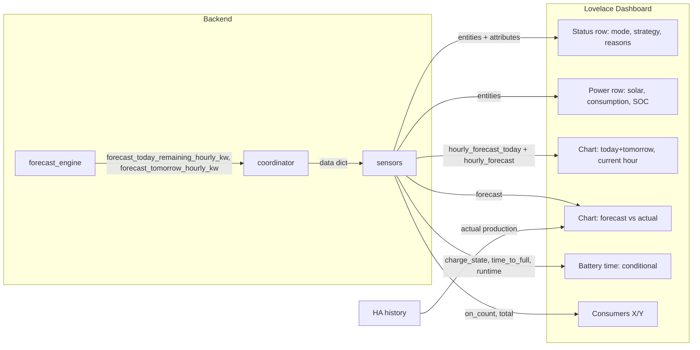

# תכנון דשבורד Energy Manager

## מטרה

דשבורד אחד, מינימליסטי, שמציג את כל המידע הנדרש: מצב, המלצה + סיבה, ייצור/שימוש, גרף תחזית היום+מחר (עם הדגשת השעה הנוכחית), גרף משולב תחזית vs בפועל, זמן סוללה מתחלף (עד 100% / עד 10%), ומכשירים דולקים (X/Y).

---

## 1. שינויי Backend (מינימליים)

### 1.1 תחזית שעתית להיום (להגרפים)

כרגע יש רק `forecast_tomorrow_hourly_kw`. כדי לצייר **היום מהשעה הנוכחית + מחר** ולהדגיש את **הבר של השעה הנוכחית** נדרש:

- **[forecast_engine.py](custom_components/energy_manager/engine/forecast_engine.py)**  
  - ב-`SolarForecast`: להוסיף שדה `forecast_today_remaining_hourly_kw: list[float]`.  
  - אחרי חישוב `tomorrow_hourly_kw`, למלא:  
  `today_remaining = [round(total_power_per_hour[i], 2) for i in range(hour_index, min(24, len(total_power_per_hour)))]`  
  - להעביר ב-`result = SolarForecast(...)` גם את `forecast_today_remaining_hourly_kw=today_remaining`.
- **[coordinator.py](custom_components/energy_manager/coordinator.py)**  
  - ב-`_build_data()`: לקרוא מ-`forecast` את `forecast_today_remaining_hourly_kw` (או רשימה ריקה) ולהוסיף ל-dict שמחזירים (למשל `"forecast_today_remaining_hourly_kw"`).
- **[sensors.py](custom_components/energy_manager/entities/sensors.py)** – חיישן **Forecast Tomorrow**  
  - ב-`_handle_coordinator_update` של `EnergyManagerForecastTomorrowSensor`: להוסיף ל-`extra_state_attributes`:  
    - `hourly_forecast_today`: `data.get("forecast_today_remaining_hourly_kw") or []`  
    - `current_hour_index`: `0` (תמיד – הבר הראשון ב-`hourly_forecast_today` הוא השעה הנוכחית).
  - כך הכרטיס יבנה גרף: `hourly_forecast_today` ואז `hourly_forecast` (מחר), ויידע שהבר הראשון מודגש.

אין צורך בחיישן חדש – רק מאטריבוטים נוספים על החיישן הקיים.

---

## 2. מבנה הדשבורד (Lovelace)

מתאים ל-**כרטיס אחד** או **פאנל אחד** בדשבורד קיים. מומלץ להשתמש ב-**apexcharts-card** (RomRider) לגרפים, ו-**conditional** להצגת זמן הסוללה לפי מצב טעינה/פריקה.

### 2.1 סרגל סטטוס (שורה קומפקטית)

- **מצב**: `energy_manager_mode` + **סיבה**: `mode_reason`.
- **המלצה**: `strategy_recommendation` + **סיבה**: `strategy_reason`.  
אפשרות: שתי שורות טקסט קטנות, או כרטיסי גלופה עם האייקון והערך.

### 2.2 שורת ערכים (ייצור / שימוש / סוללה)

- **ייצור עכשיו**: `solar_production_kw` (kW).  
- **שימוש בית**: `house_consumption_kw` (kW).  
- **סוללה**: `battery_soc` (%) + `battery_power_kw` (חיובי=פריקה, שלילי=טעינה).  
- **מצב סוללה**: `battery_reserve_state` (אופציונלי).  
מינימליסטי: שלושה מספרים + SOC, בלי עומס ויזואלי.

### 2.3 גרף ראשי: תחזית היום + מחר, השעה הנוכחית מודגשת

- **נתונים**:  
  - סדרה אחת: `hourly_forecast_today` (מהשעה הנוכחית עד סוף היום) + `hourly_forecast` (24 שעות מחר).
- **ציר X**: תוויות זמן – מתחילת `hourly_forecast_today` (שעה נוכחית) ועד סוף מחר.  
- **הדגשה**: הבר הראשון (אינדקס 0) – צבע שונה (למשל `plotOptions.bar.colors.ranges` או סדרה נפרדת של "בר נוכחי" עם ערך רק באינדקס 0).  
- **מקור**: `sensor.forecast_tomorrow` + `entity.attributes.hourly_forecast_today` ו-`entity.attributes.hourly_forecast`, עם `data_generator` שמחזיר מערך ל-ApexCharts (כבר יש דוגמה אצלך עם `hourly_forecast` וטסטמפים).

### 2.4 גרף משולב: תחזית vs ייצור בפועל

- **תחזית**: אותה סדרה (היום מהשעה הנוכחית + מחר) – bars או קו.  
- **בפועל**: היסטוריה של חיישן **הייצור הסולארי** (האותו שמזין את `solar_production_kw` – לרוב statistics/statistic או sensor מהאינברטר).  
  - ב-ApexCharts: סדרה שנייה ממקור `entity` עם `type: line` או `area`, עם `history`/statistics של החיישן (לפי איך apexcharts-card תומך ב-history).
- על אותו ציר זמן: עד "עכשיו" – ערכים בפועל; מהשעה הנוכחית ואילך – תחזית.  
אם הכרטיס לא תומך היטב ב-mix של attribute + history באותו גרף, חלופה: גרף אחד לתחזית (היום+מחר) וגרף שני לייצור בפועל (history), אחד מתחת לשני.

### 2.5 זמן סוללה (מתחלף)

- **כשהסוללה בטעינה** (`charge_state` = `on` או `max`): להציג **"תוך כמה זמן ל-100%"** – חיישן `sensor.battery_time_to_full` (או ה-entity_id המתאים אצלך).  
- **כשהסוללה בפריקה** (אחרת): להציג **"תוך כמה זמן ל-10%"** – חיישן `sensor.battery_runtime`.  
- מימוש: שני כרטיסי גלופה (או טקסט) עם **conditional** – `entity: sensor.charge_state`, `state: "on"` / `"max"` להצגת Time To Full, אחרת להצגת Battery Runtime.  
אין צורך בלוגיקה ב-backend – שני החיישנים כבר קיימים; רק לוגיקת תצוגה ב-Lovelace.

### 2.6 מכשירים דולקים

- **טקסט/גלופה**: "X / Y מכשירים" – `consumers_on_count` / `consumers_total`.  
- מקור: חיישן שמחזיר את הערך (או attributes של חיישן מרכזי) – כבר קיים ב-coordinator כ-`consumers_on_count` ו-`consumers_total`; לוודא שיש sensor שמחשף אותם (למשל "Consumers On" עם attributes).

### 2.7 אופציונלי (לפי מקום)

- **Daily margin** (`daily_margin_kwh`), **מצב רזרבה** (`battery_reserve_state`), **רשימת מכשירים להמלצה לכבות** (`recommended_to_turn_off_entity_ids`) – בשורה נפרדת או כרטיס מתקפל אם רוצים מינימליזם אבל גישה לפרטים.

---

## 3. מקור נתונים – סיכום

| מה להציג             | מקור (entity/attribute)                                                                         |
| -------------------- | ----------------------------------------------------------------------------------------------- |
| מצב + סיבה           | `energy_manager_mode`, `mode_reason`                                                            |
| המלצה + סיבה         | `strategy_recommendation`, `strategy_reason`                                                    |
| ייצור/שימוש/סוללה    | `solar_production_kw`, `house_consumption_kw`, `battery_soc`, `battery_power_kw`                |
| תחזית שעתית היום+מחר | `sensor.forecast_tomorrow` → `hourly_forecast_today` + `hourly_forecast`, בר ראשון = שעה נוכחית |
| ייצור בפועל (גרף)    | היסטוריה של חיישן הייצור הסולארי (אותו שמזין את האינטגרציה)                                     |
| זמן עד 100%          | `sensor.battery_time_to_full` (לפי charge_state)                                                |
| זמן עד 10%           | `sensor.battery_runtime` (לפי discharge)                                                        |
| מכשירים דולקים       | חיישן עם on_count / total (או שני sensors)                                                      |

---

## 4. אופן אספקה למשתמש

- **אפשרות א**: קובץ YAML לדשבורד (למשל `dashboards/energy_manager.yaml` או `examples/lovelace_energy_manager.yaml`) עם apexcharts-card + כרטיסים, וקובץ README קצר שמסביר איך לייבא/להדביק ולעדכן entity_ids.  
- **אפשרות ב**: רק תיעוד ב-README – רשימת entities ואטריבוטים + דוגמאות לכרטיסים (גרף, conditional, שורת סטטוס) כדי שהמשתמש יבנה בעצמו.

מומלץ **אפשרות א** עם YAML מוכן, כך שהדשבורד "עובד out of the box" אחרי עדכון entity_ids.

---

## 5. דיאגרמה – זרימת נתונים לדשבורד

---

## 6. סדר ביצוע מומלץ

1. **Backend**: הוספת `forecast_today_remaining_hourly_kw` ב-forecast_engine, coordinator, ואטריבוטים ב-Forecast Tomorrow sensor.
2. **Lovelace**:
  - שורת סטטוס + שורת ערכים + מכשירים דולקים + זמן סוללה (conditional).  
  - גרף היום+מחר עם הדגשת הבר הראשון.  
  - גרף משולב תחזית vs בפועל (או שני גרפים אם כרטיס אחד לא נוח).
3. **תיעוד**: README או הערות ב-YAML עם רשימת entity_ids והתאמה למשתמש.

אם תרצה, בשלב היישום אפשר לפרט את ה-`data_generator` ואת מבנה ה-conditional המדויק לפי שמות ה-entities אצלך.