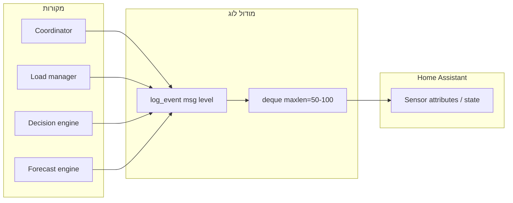

# מערכת לוגים פנימית לאינטגרציה

## האפשרות המוצעת: באפר בזיכרון + חיישן ב-HA

**רעיון:** מודול קטן שמחזיק רשימה מוגבלת (למשל 50–100 רשומות) של אירועים עם חותמת זמן. בכל אירוע משמעותי (שינוי מצב, כשל תחזית, הפעלה/כיבוי צרכן) נוסיף שורה לבאפר. החיישן ב-HA יציג את הרשומות האחרונות (למשל כ־attribute או state מסודר) כך שניתן לראות מה קרה בלי לפתוח את הלוג הכללי.

**יתרונות:** אין קבצים, אין תלויות, עובד גם ב־read-only; המשתמש רואה היסטוריה ישירות ב־Entity.

---

## מורכבות: **בינונית-נמוכה**

| משימה                                                     | הערכה       |
| --------------------------------------------------------- | ----------- |
| מודול לוג פנימי (deque + פונקציית log)                    | פשוט        |
| חיבור נקודות קיימות (coordinator, load_manager, decision) | פשוט–בינוני |
| חיישן/attribute שמציג את הרשומות                          | פשוט        |
| שמירה על סדר ואורך מקסימלי                                | פשוט        |

**סדר גודל:** כ־1–2 שעות פיתוח. לא דורש תלויות חיצוניות.

---

## ארכיטקטורה (בקצרה)

- **מודול לוג:** קובץ אחד (למשל `custom_components/energy_manager/log_buffer.py`) עם `collections.deque(maxlen=N)` ו־`log_event(entry_id, message, level="info")`. אפשר גם לשלב עם `_LOGGER` כך שהלוג הרגיל של HA ימשיך לקבל את אותם אירועים.
- **חיבור:** ב־[coordinator.py](custom_components/energy_manager/coordinator.py) – אחרי עדכון מודל/החלטה/תחזית, קוראים ל־`log_event` עם ה־entry_id והטקסט (למשל "mode=saving, reason=Low battery"). ב־[load_manager.py](custom_components/energy_manager/engine/load_manager.py) – לפני/אחרי `turn_on`/`turn_off`. ב־[forecast_engine.py](custom_components/energy_manager/engine/forecast_engine.py) – כשמחזירים `available=False`.
- **חשיפה ב-HA:**  
  - **אפשרות א:** חיישן דיאגנוסטי "Energy Manager Log" שהמצב שלו הוא מספר הרשומות או השורה האחרונה, ו־`extra_state_attributes` מכיל `entries: list[str]` (למשל `["2025-03-14 12:00:00 | mode=saving", ...]`).  
  - **אפשרות ב:** אותו דבר אבל רק כ־attribute על device/entity קיים (פחות בולט אבל פשוט).

מומלץ להתחיל עם **אפשרות א** (חיישן ייעודי) כי קל למצוא ולדבג.

---

## קבצים שישתנו

1. **חדש:** `custom_components/energy_manager/log_buffer.py` – באפר, פונקציית `log_event`, ופונקציה `get_recent_entries(entry_id)` שמחזירה רשימה לעדכון חיישן.
2. **[coordinator.py](custom_components/energy_manager/coordinator.py)** – ייבוא ו־קריאות ל־`log_event` אחרי החלטה, כשל תחזית, ואולי פעם ב־N עדכונים "heartbeat".
3. **[load_manager.py](custom_components/energy_manager/engine/load_manager.py)** – קריאות ל־`log_event` לפני/אחרי הפעלה/כיבוי צרכנים (אפשר להעביר את ה־entry_id דרך ה־LoadManager או דרך ה־coordinator).
4. **[entities/sensors.py](custom_components/energy_manager/entities/sensors.py)** – חיישן חדש (או הרחבת קיים) שמציג את `get_recent_entries(entry_id)` ב־attributes ו־state (למשל "Last: ..." או מספר רשומות).
5. **[coordinator.py](custom_components/energy_manager/coordinator.py)** – ה־return dict יכלול את רשימת הרשומות האחרונות (או החיישן יקרא ישירות מה־log_buffer לפי entry_id ב־_handle_coordinator_update).

הערה: ה־log buffer צריך להיות מפתח לפי `entry_id` כי יכולים להיות כמה התקנות (config entries). כלומר: `_buffers: dict[str, deque]` או מבנה דומה.

---

## סיכום

- **כמה מסובך?** בינונית-נמוכה – בעיקר הוספת מודול קטן וחיווט קריאות במקומות הקיימים.
- **המלצה:** באפר בזיכרון (deque) + חיישן דיאגנוסטי שמציג את הרשומות האחרונות ב־HA, בלי קבצי לוג ובלי תלויות חדשות.

